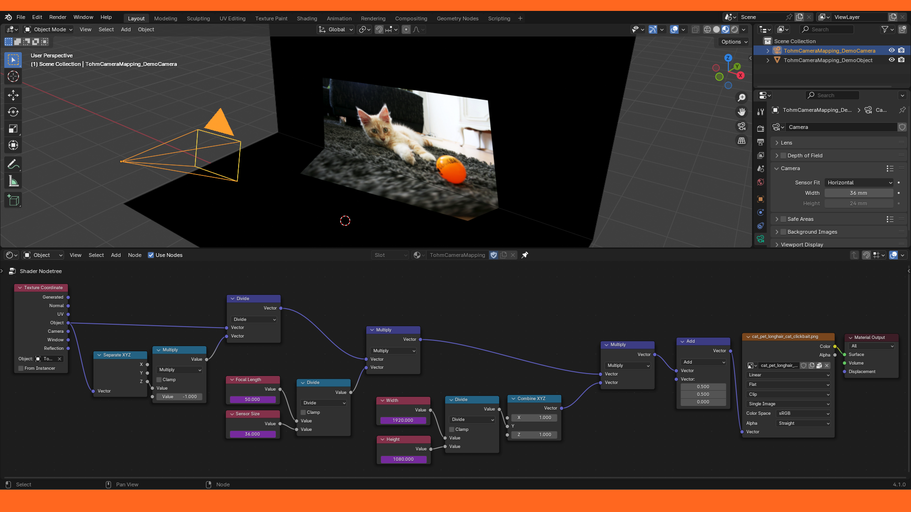
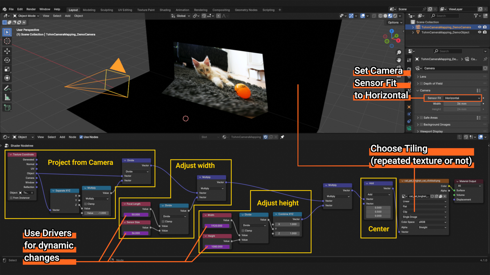
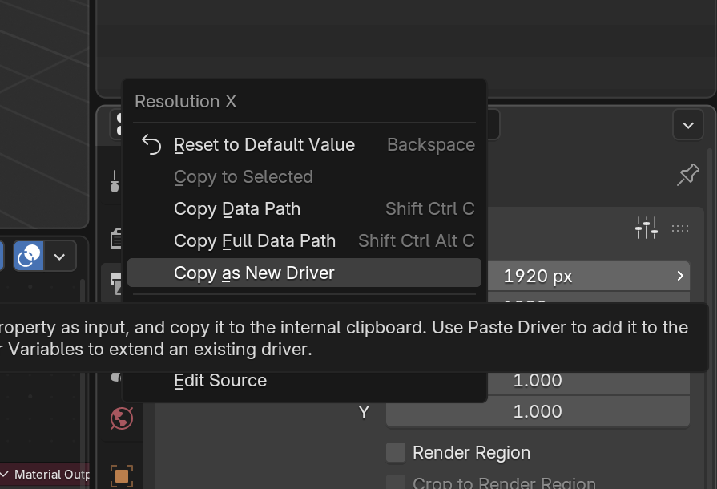
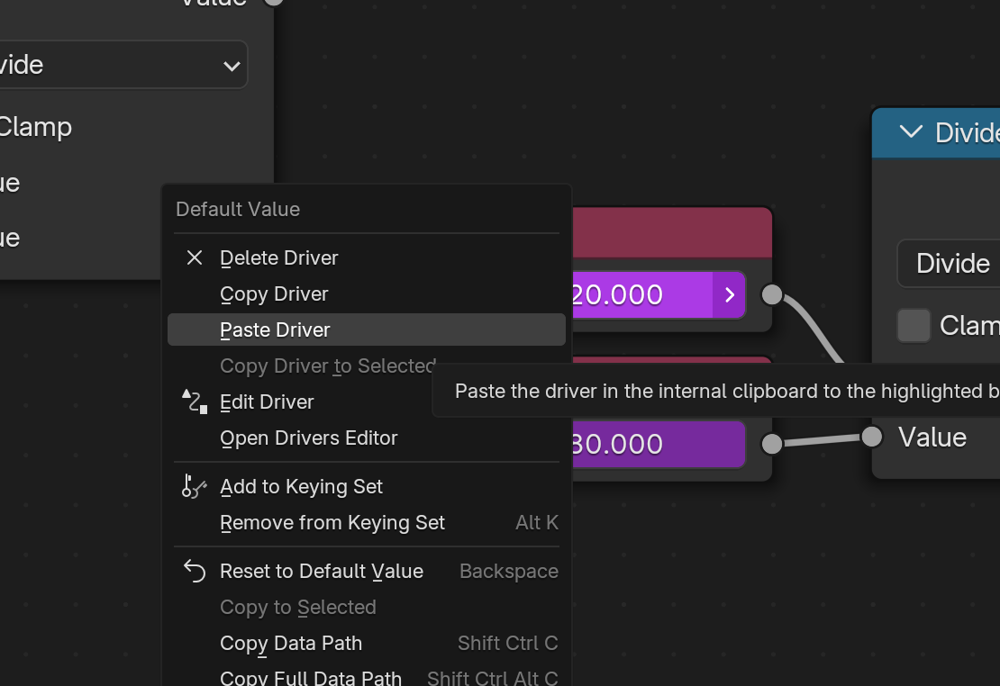

# Camera Mapping

### Project texture on object from camera / viewpoint

## Main features
- 100% accurate
- Real-time (Shader Edirot so GPU based)
- Clip / extend / repeat texture
- Full control: location rotation (scale)
- Camera specifications accurate (sensor size, focal length)
- Scene specifications accurate (width, height)
- Works for video too (--> 3D camera tracking)
- As many projections as needed

*Doest it makes **UV Project** Modifier obsolete? Let me know.*

## Explanations

### Orient Texture Space
- Make the camera the coordinates for texture
- Multiply by the Z distance of the camera so it looks the same size everywhere from the camera point of view

### Adjust size (or width)
- Divide by the **Camera Ratio**
$$
\text{Camera Ratio} = \frac{\text{Focal Length}}{\text{Sensor Size}}
\quad;\quad
\text{Sensor Size} = \text{Sensor Width}
$$
- Make sure **Sensor Size** is the **Sensor Width** in the Camera Settings, don't let to default value *Auto*

### Adjust ratio (or height)

- Multiply the Y coordinate by the **Scene Ratio** (and X coordinate by 1)
$$
\text{Scene Ratio} = \frac{\text{Scene Width}}{\text{Scene Height}}
$$

### Center

- Add $ 0.5 $ both to X and Y

### Optionnal Drivers

- Make the **four previous parameters** updating real time with drivers

|||
|-|-|
|||