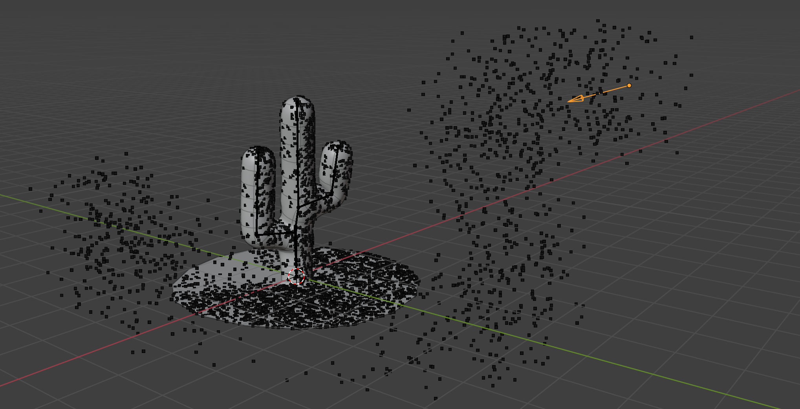
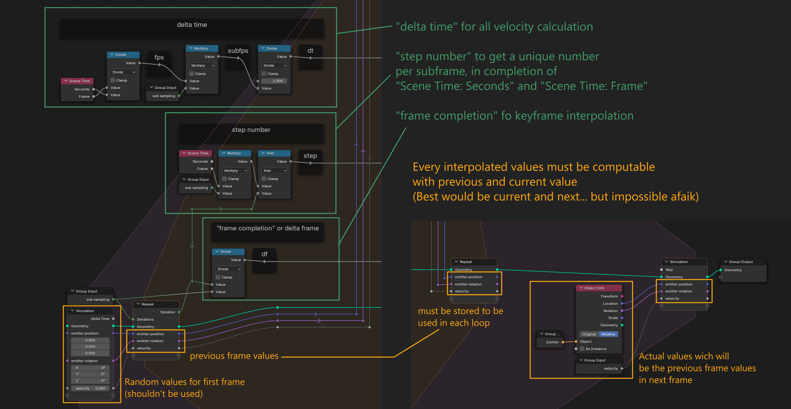
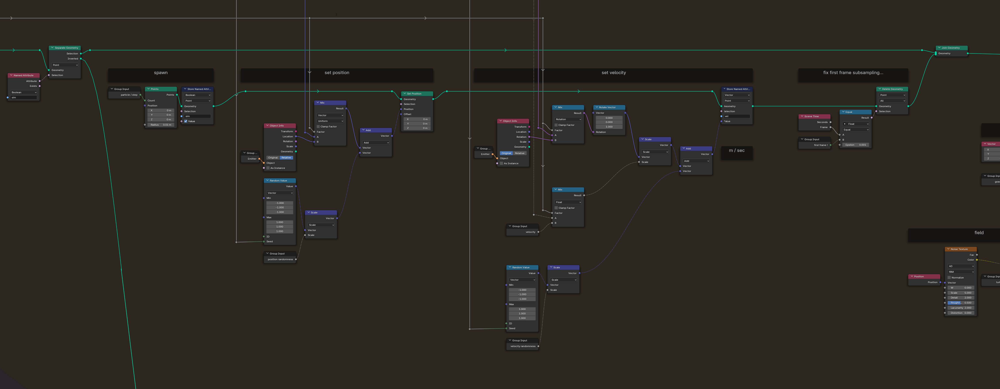
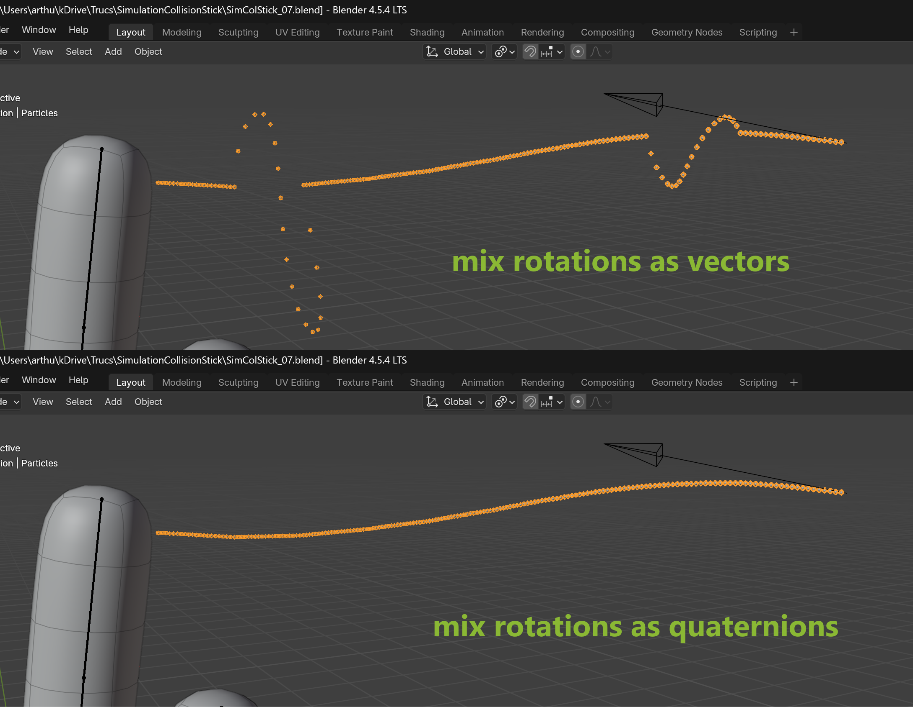
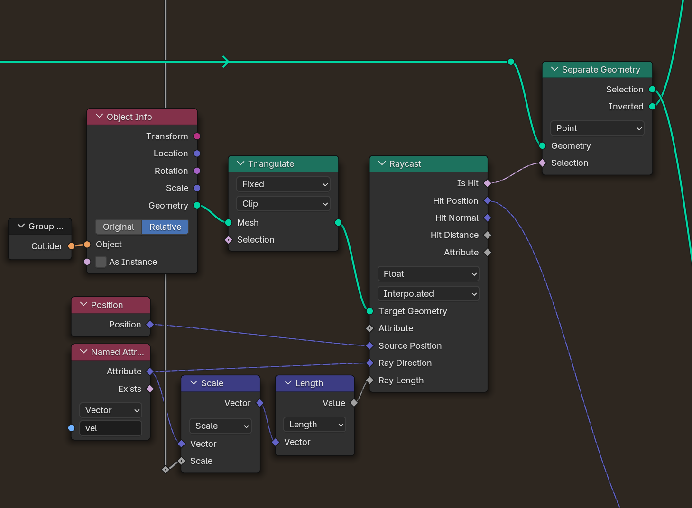
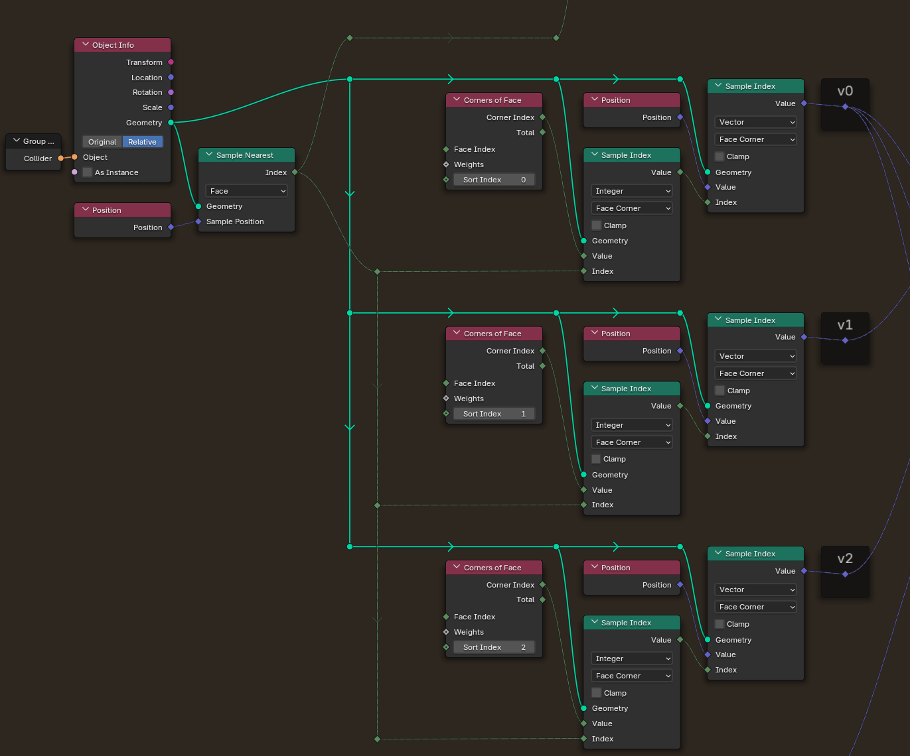
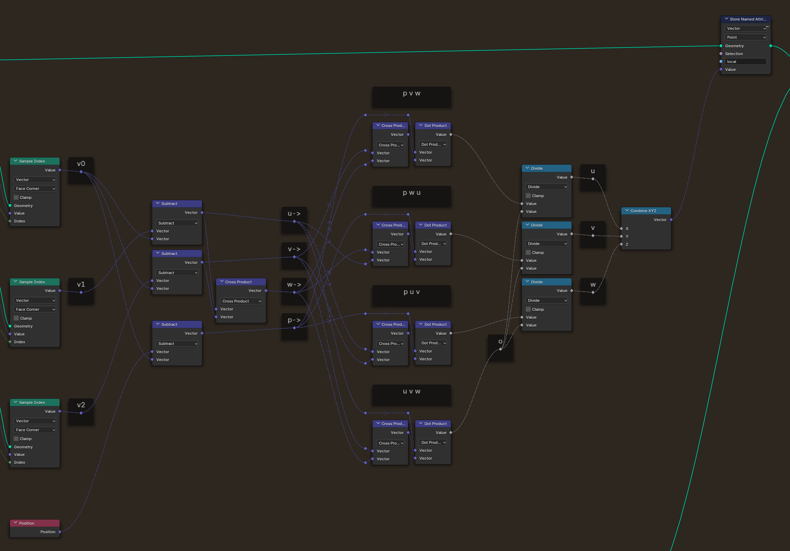
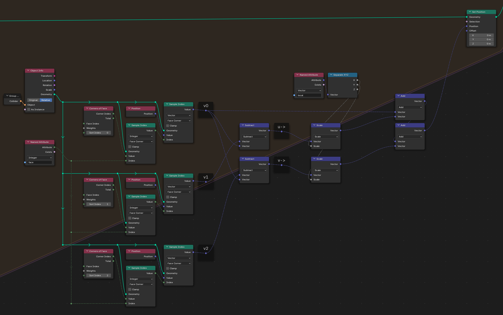

# Particle System A

## Elementary particle system to build on

Don't ask why a cactus.

General overview of the node tree. Be aware that the last version is not exactely this.

### Main features
- **Sub-frame**
- Allow **Field(s)** (and gravity)
- **Euler Explicite** type
- Stick to animated mesh collider
- Basic emission parameters
- Emitter Object driven 
- Particle deletion
- Scene framerate independant

### Overall principles of this tree

- Units in **meter** and **second**
- Particle amount $=$ particle count $\times$ subframe count ; so **adding subframes adds particles**
- **Subframe** count and **framerate** **don't change overall behaviour** ; increasing subframe doesn't make particles faster or slower, or following different paths
- **Keyframe iterpolations are linear**

# Component Descriptions

## Nested Repeat Zone

### Main problematics:
- geting / counting the **current subframe** (~easy)
- **interpolate** keyframed parameter values (~tricky)  

### Needed variables:
- framerate
- current subframe
- subframe duration (delta time dt)
- previous values for interpolation coulutation

## Spawn / adding particles in the system

### Spawn
- Create $n$ particles with **Points** node
- Labelize them part of simulation with **Store Named Attribute** node
### Set Position
- Place them regarding
  - Emitter *interpolated* position
  - Random position parameter (seed = actual subframe)
### Set Velocity
- Set (initial) velocity regarding
  - Emitter *interpolated* orientation (must be mixed with Rotation c.f. below)
  - Scale it by *interpolated* veocity parameter
  - Add randomness from *interpolated* velocity randomness parameter
- Delete particles if we ara at first frame (interpolation will fail because there is no previous frame to get correct values from)
- Put them into particle system with **Join Geometry** node

**Mix** node must be set in **Rotation** mode and not **Vector**, converting (I guess) vector to quaternion, rotate then convert back to vector

## Set Velocity

- Calculate next position regarding
- Own velocity
- Field (we can add others)
- Gravity

## Triangulation

A lot of this system is based on **triangle's vertices** to get **local coordinates**. Every time we sample the collider's geometry we triangulate the mesh not to have quads or polygons.  
The Triangulation must be fast and stable (allways the same) in the tree so we set it as **Fixed** and **Clip**.  
The results on non triangulate meshes will be less precise, particles will maybe *levitate* slightly above the mesh, but *my guess* is that it won't be noticable.  
A fast Fix would be adding a **Sample Nearest Surface** + **Set Position** at the very end.

## Collision Detection

Using a **Raycast** makes it really precise:
Every particle is casted on target mesh regarding its own position and velocity. It is asking "Will I hit mesh between now and next subframe?".  
They are then separated into two pipelines:
- Regular simulation
- No simulation but stick to the collider mesh (need constant update if collider moves)

The **Raycast** plays huge role here and the performances might be affected for this verx precise method.

## Set Position (regular simulation)

Simply adding *velocity* $\times$ *delta time* to position.  

## Set Position (stick to collider)

### 1. Get the hit face $f$ index of the collider
Below we assert face is a triangle (not quad, not poly)

### 2. Describe the particle position $p'$ in a local space
We need to describe the position of the particle only in terms of the face $f$ vertices $v_0$, $v_1$, $v_2$ and also two factors $u$ and $v$.  
These will give us the **local coordinates** of the particle.  

$$ 
\vec{u} ~~=~~ \overrightarrow{v_0 \, v_1} ~~=~~ v_1 - v_0
\quad;\quad
\vec{v} ~~=~~ \overrightarrow{v_0 \, v_2} ~~=~~ v_2 - v_0 
\quad;\quad
\vec{w} ~~=~~ \vec{u} \times \vec{v}
$$

ouais

$$ 
p' ~~=~~ v_0 + u \, \vec{u} + v \, \vec{v} + w \, \vec{w}
$$

$\vec{w}$ in shown but not necessary on this system because we assert particle is *on* the triangle, so there is no local height. $w$ will allways be $0$.

### 2.1 Get face index and vertices of this face

### 3 Calculating $u$ and $v$
They require two "helpers": $\vec{p}$ and $o$ (below $p$ is the particle's global position)
$$
\vec{p} = p - v_0
\quad;\quad
o = \vec{u} \cdot ( \vec{v} \times \vec{w})
$$

ouais

$$
u = \frac{\vec{p} \cdot ( \vec{v} \times \vec{w})}{o}
\quad;\quad
v = \frac{\vec{p} \cdot ( \vec{w} \times \vec{u})}{o}
\quad;\quad
w = \frac{\vec{p} \cdot ( \vec{u} \times \vec{v})}{o}
$$

### 4 Store local coordinate
The involved vertice positions will change over frames, so we need to get their coordinates at each frame. We do so via storing:
- face $f$ (index)
- factor $u$ (scalar)
- factor $v$ (scalar)
- (factor $w$ (scalar))  

### 5 Place the particle back "on the mesh"  
Get $v_0$, $v_1$, $v_2$ updated coordinates  
Calculate $\vec{u}$, $\vec{v}$, ($\vec{w}$)  
Calculate global coordinate with:  

$$
p = v_0 + u \, \vec{u} + v \, \vec{v} + w \, \vec{w}
$$

