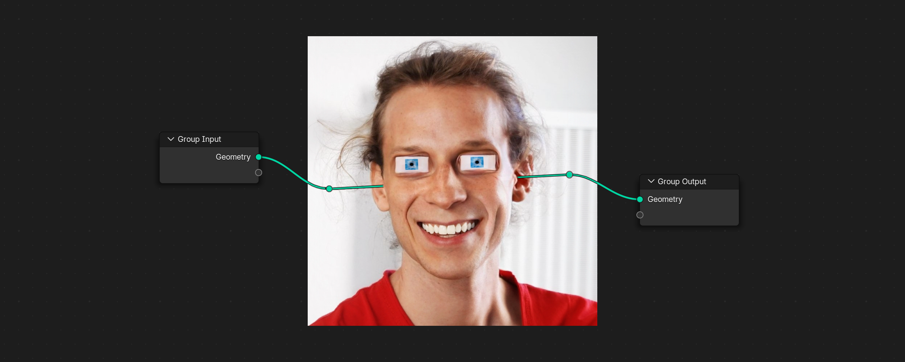

# Tohm Blender Geometry Node Collection

A collection of useful Blender Geometry Node trees — some created by me, some by others.  
Feel free to use them for learning or in your projects, but please **do not sell** them.

## Projets

- [SoccerBall](https://github.com/arthurbourquin/SoccerBall-GeometryNode)
- [ParticleSystemA](https://github.com/arthurbourquin/ParticleSystemA-GeometryNode)
- [CameraMapping](https://github.com/arthurbourquin/CameraMapping-GeometryNode)
- [Simpler Deform](https://github.com/arthurbourquin/SimplerDeform-GeometryNode)

## Features
- Ready-to-use Geometry Node trees
- Suitable for learning and experimentation
- Free to use under non-commercial terms

## Contact
If you have questions, suggestions, or want to reach me, you can contact me via my Discord:  
[Discord](https://discord.gg/JTHhAkmnhv)

---

Made with ❤️ for lovers of math, geometry, and generative coding.
