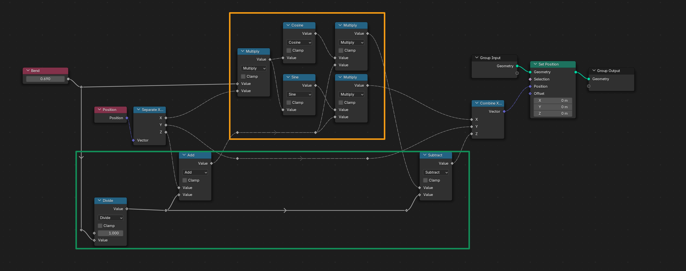
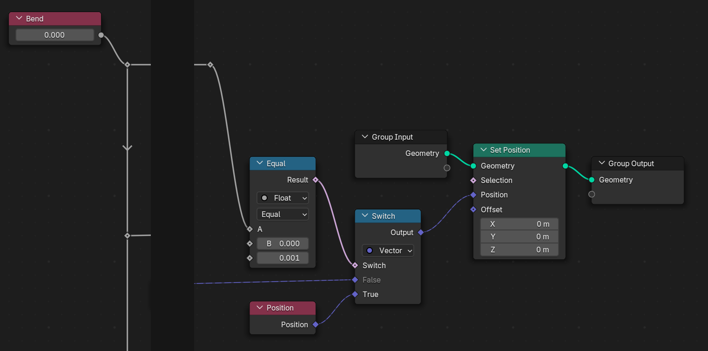

# Simpler Deform

### Simple Deform made simpler (I hope)

## Explanation

### Core operation

- Making a "simple" **trigonometric parameterization** (orange)
- "Sandwich" **Offsetting** center according to Z axis (green)

*Simple* for people familiar with trigonometry.  
The *sandwich* is a general technique that consists of applying a transformation before an operation and reversing that transformation after the operation.

**Core operation direct formula**

$
\text{Bend factor } b
\quad;\quad
\begin{cases} 
x' = \sin(b \, x) (z + \frac{1}{b}) \\
y' = y \\
z' = \cos(b \, x) (z + \frac{1}{b}) - \frac{1}{b}
\end{cases}
$

**Core operation indirect formula**

$
\begin{aligned}
& \text{Bend factor } && b \\
& \text{Frequency } && t = b \, x \\
& \text{Offset } && o = \frac{1}{b} 
\end{aligned}
\quad;\quad
\begin{cases} 
x' = \sin(t) (z + o) \\
y' = y \\
z' = \cos(t) (z + o) - o
\end{cases}
$

### User friendlyness

Avoiding division by zero with a **Switch Node**

