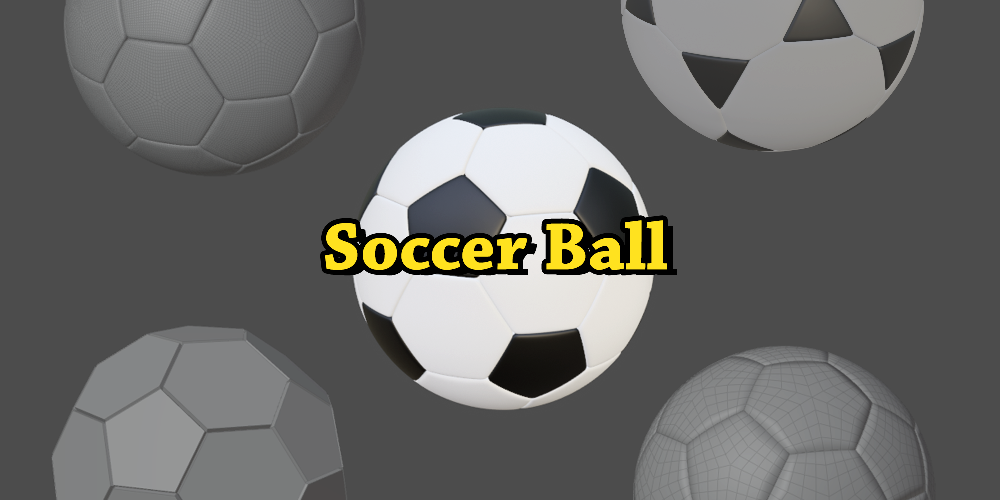
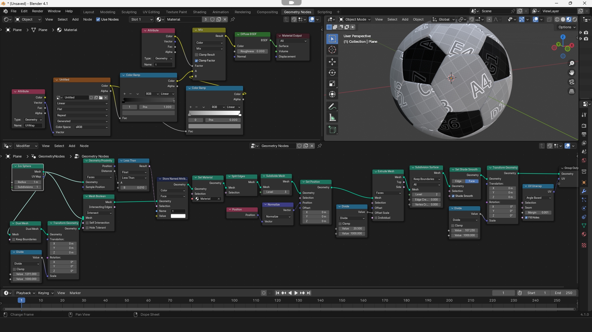
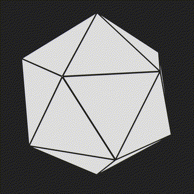
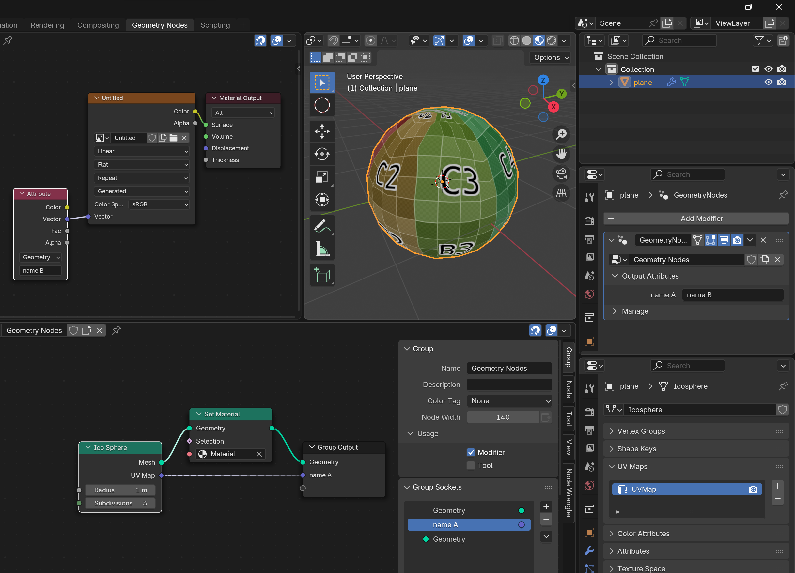

# Procedural Soccer Ball

## Full Setup

## Explanations

### Base shape

The geometric solid of the traditionnal soccer ball is a **truncated dodecaedron** or a **truncated icosahedron** (see the platonics).  
To create this base shape in Blender Geometry Nodes, we need two steps:
- icosahedron --> an an unsubdivided **Ico Sphere**   
- Dodecaedron --> the previous icosahedron passing through a **Dual Mesh** node  

Once we have both shape, we can take the **intersection** with a **Mesh Boolean** node. Playing with the **scale** of one of it, we can shape it to a visually correct base shape (here I use the magic number 1291, the birth of Switzerland, which is totally unrelated, but looks nice to me).

### Global Rounding

(**Split Edges** to have all faces separated, needed next.)
**Subdivide Mesh** (not Subdivision Surface), here level 3, to get enough geometry to shape it spherical.  
Then we simply **Set Position** to the normalized position of each vertice, making all of them at 1 meter of center.

### Soccer ball faces rounding

**Extrude Mesh** on Faces (not individual) of low amount to give thickness.  
Add a **Subdivision Surface** to gives it a rounded, inflated appearance.
Don't forget to **Set Shade Smooth**.
You can scale it down to about 0.107 to make it about the official size.

### Colors

There is two sets of faces, pentagons and hexagons (but can also be triangles and octogons). We can get on set of faces by using a **Geometry Proximity** node, taking one of the primitive a source faces and comparing with the faces distance of the truncated geometry. Once done, we **Store Name Attribute** the boolean in the geometry.  
Then we can get the attribute (here it's a boolean, so black if "not" and white if "true") in the **Shader Editor** via **Named Attribute** node.  
It is important to have a **Set Material** in the Geometry Node tree and pick the right material.

### UVs

For the UVs, I'm note sure this is the best way, but I only found this way to get them in the **Shader Editor**_
- getting a UV map, directly or by UV Unwrapping with **UV Unwrap** node as an **output attribute**
- In the **Geometry Node** Modifier, give a name (the same or not) to the attribute to be used outside de Geometry Node
- Get it back via **Attribute** node in the **Shader Editor**

